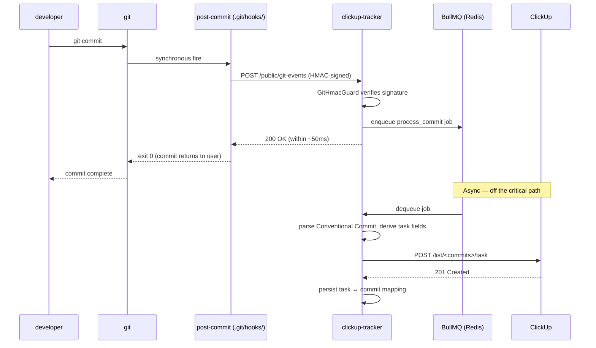
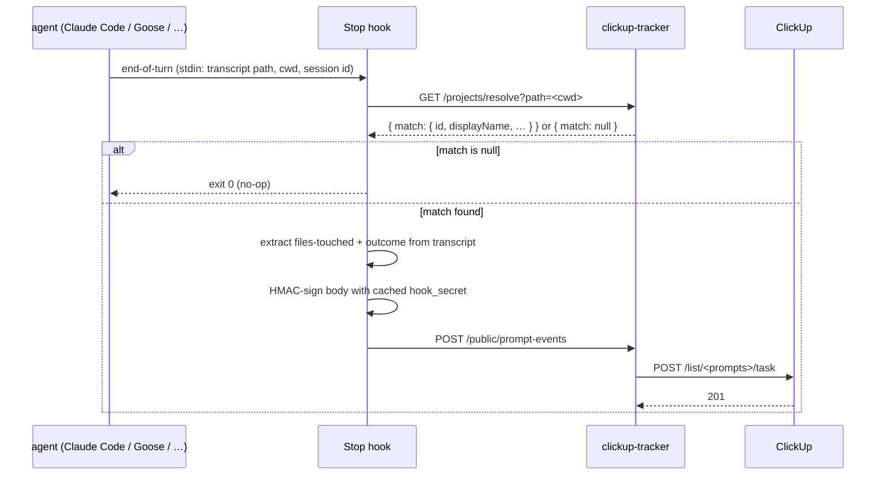

# Architecture

The daemon has three event sources and one outbound sink (ClickUp). Everything is queue-mediated — HTTP returns 200 fast, work happens asynchronously.

## Components

```
┌──────────────────────────────────────────────────────────────┐
│ host                                                         │
│                                                              │
│  ┌──────────────┐   ┌─────────────────────────────────────┐  │
│  │ tracked repo │   │ docker compose                       │  │
│  │  .git/hooks/ │   │  ┌─────────────┐  ┌──────────────┐   │  │
│  │  post-commit ├──▶│  │ clickup-    │  │ postgres     │   │  │
│  └──────────────┘   │  │ tracker     │◀▶│ (cup_pgdata) │   │  │
│                     │  │ (NestJS)    │  └──────────────┘   │  │
│  ┌──────────────┐   │  │ :4020       │  ┌──────────────┐   │  │
│  │ Claude Code  │   │  │             │◀▶│ redis        │   │  │
│  │ Goose        │──▶│  │  + BullMQ   │  │ (cup_redisdata)│  │
│  │ OpenCode …   │   │  │  + drift    │  └──────────────┘   │  │
│  └──────────────┘   │  │  cron       │                     │  │
│                     │  └─────┬───────┘                     │  │
│  ┌──────────────┐   │        │                              │  │
│  │ MCP client ◀─┼───┼──stdio─┘ (mcp/dist/server.js)         │  │
│  └──────────────┘   └─────────────────┬──────────────────────┘  │
└─────────────────────────────────────────┼─────────────────────┘
                                          ▼
                                ┌──────────────────┐
                                │ ClickUp REST API │
                                └──────────────────┘
```

## Sequence: git commit → ClickUp task



If the daemon is unreachable, the hook falls back to writing the payload to `~/.cache/cup-cli/buffer/<sha>.json` and exits 0 — the commit never blocks. A future cron sweep replays buffered payloads.

## Sequence: AI agent turn → ClickUp prompt task



## Sequence: drift cron

Every `CUP_TRACKER_DRIFT_MINUTES` (default 60), the daemon enqueues a `git_drift` job per active project:

1. Read repo HEAD via `git -C <localPath> rev-parse HEAD`.
2. Compare against the `last_synced_commit` row in Postgres.
3. For each commit in between, enqueue `process_commit` (deduped by sha).
4. Update the project's "Overview & Docs" task with a fresh README / CHANGELOG snapshot if those files changed.

This makes the daemon resilient to:

- Commits made when the post-commit hook was disabled (uninstalled, network outage).
- Commits made on another machine that pulled into the same repo.
- Manual ClickUp edits that drifted from git (the daemon doesn't undo them — it just records the divergence in the Overview task).

## Queue and degradation behavior

BullMQ runs in-process with Redis. If Redis is unreachable at boot:

- The daemon **inline-degrades** — `process_commit` runs synchronously inside the request handler instead of enqueueing.
- Throughput drops, but no events are lost.
- Once Redis is back, jobs go back to async mode automatically.

Visible in metrics as `cup_inline_processed_total` (counter).

## Auth model

| Surface | Auth | Why |
|---|---|---|
| Internal `/projects/*` | Static bearer (`STANDALONE_API_TOKEN`) if set; otherwise open | The owner controls clients. Fine for localhost. Set the bearer if exposed. |
| Public `/public/git-events`, `/public/prompt-events` | Per-project HMAC-SHA256 (`hook_secret`) | The webhook payload is the auth payload — no separate key exchange needed. Different per project. |
| `/public/metrics` | Optional separate bearer (`METRICS_AUTH_TOKEN`) | Read-only credential for Prometheus. Independent rotation from the main bearer. |
| `/health`, `/public/openapi.yaml` | Open | Liveness and self-documentation. |

## Schema

See `schema/init.sql` and `service/prisma/schema.prisma`. Two main tables:

- `projects` — registered repos, ClickUp Folder/List ids, `hook_secret`, `last_synced_commit`.
- `backups` — snapshots of the ClickUp tree, used by `/projects/:id/restore`.

## MCP server

`mcp/src/server.ts` is a thin shim — every MCP tool maps 1:1 to an HTTP endpoint on the daemon. The MCP layer adds:

- A stdio transport for agents that want it.
- Schema validation for tool arguments.
- A browsable resource (`clickup://projects`) for agents that walk MCP resources.

It is **not** the auth boundary — when an MCP client calls `clickup_register_project`, the MCP server forwards an HTTP `POST /projects` with the `STANDALONE_API_TOKEN` bearer. The daemon enforces auth, not the MCP shim.
