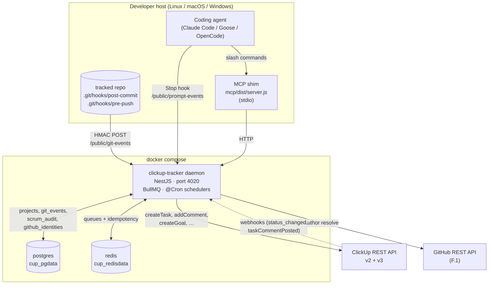
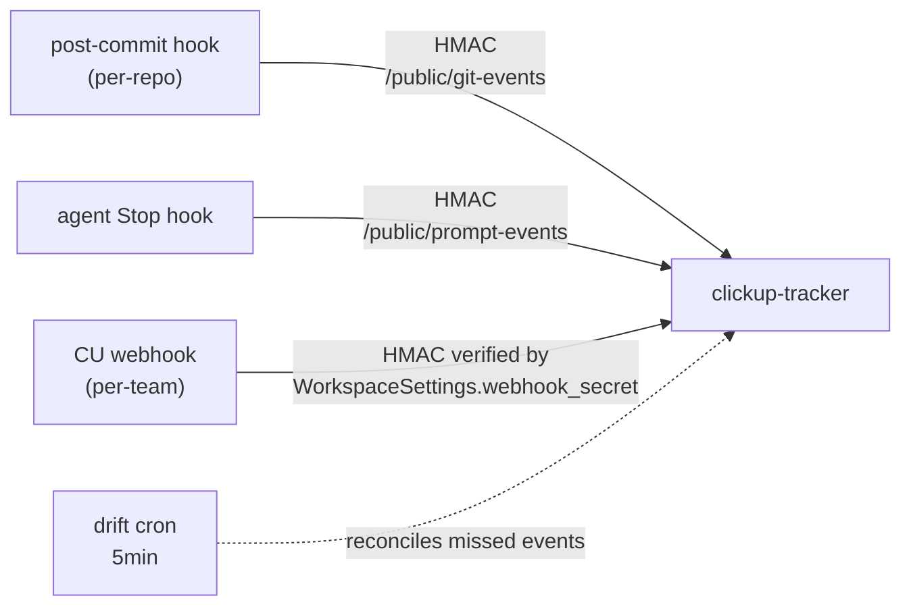
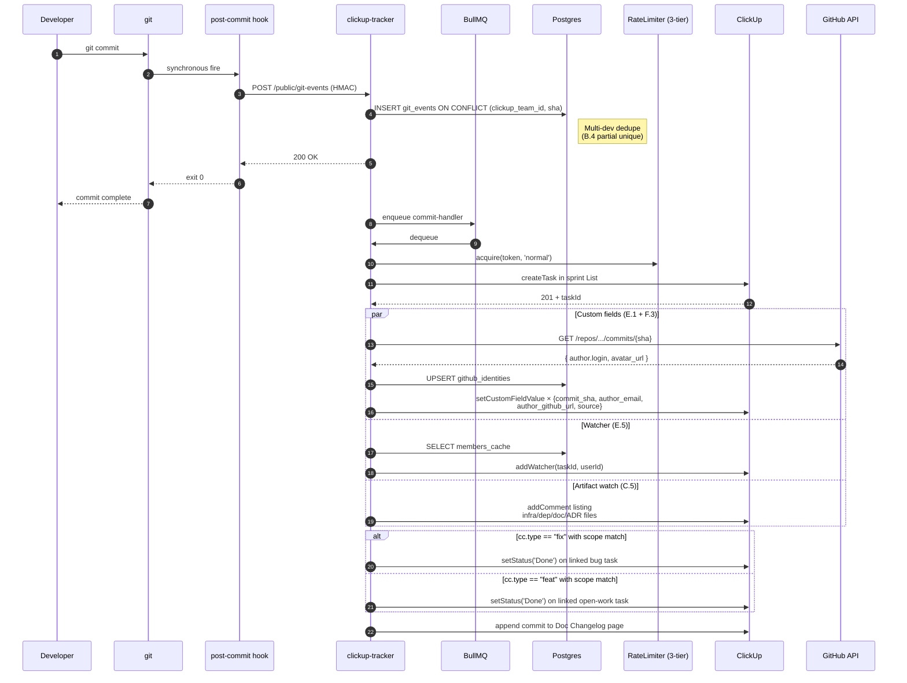
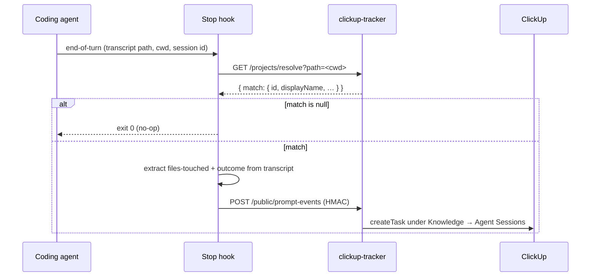
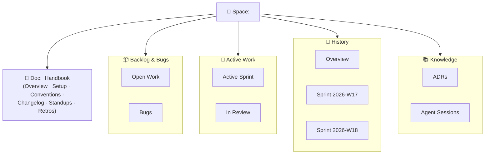
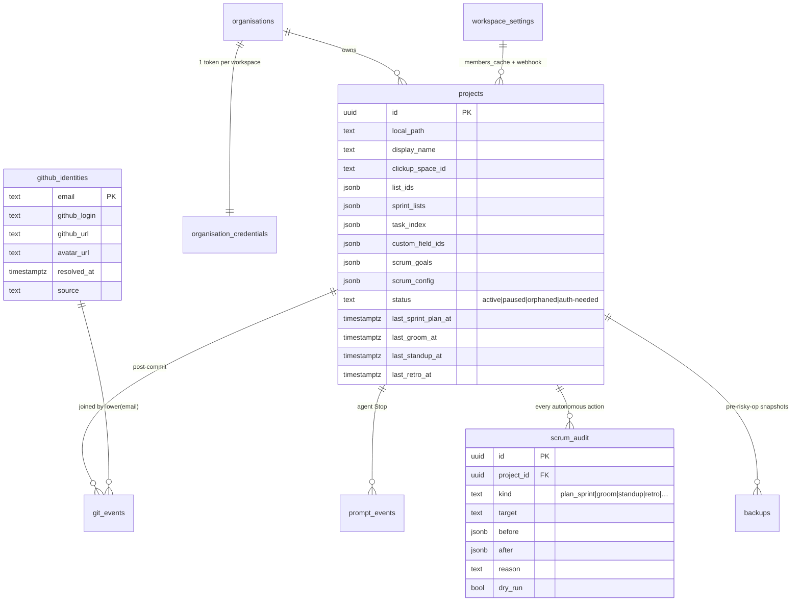
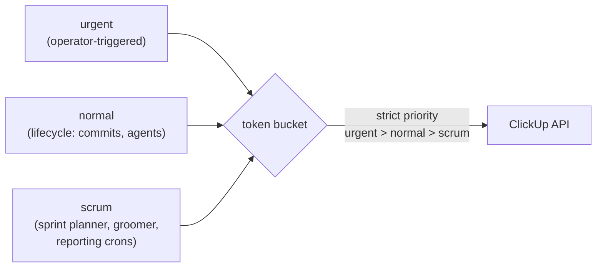
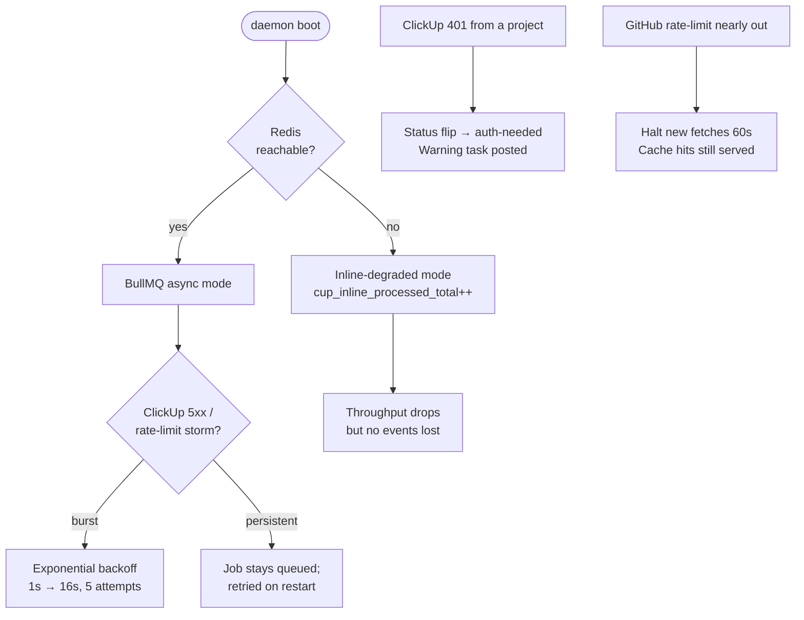

# Architecture

clickup-tracker is a self-hosted Docker daemon (NestJS + Postgres + Redis) that turns local git activity into structured ClickUp output. As of v0.4.0 it ships:

- **Per-repo CU Spaces** with a 4-folder hierarchy + a Doc handbook
- **Autonomous SCRUM operator** — Sprint planner, daily groomer, standup/retro reporter
- **Multi-developer adoption** — multiple developers' daemons can share one workspace without duplicating tasks
- **Native CU surfaces** — colored space tags, custom fields, multi-view seeds, sprint Goals, watchers, structured @-mentions
- **GitHub identity bridge** — commit author email → cached GitHub login/avatar/profile, surfaced on tasks + standup pages

This doc covers the system layout. For per-feature deep-dives see:

- [`scrum-operator.md`](./scrum-operator.md) — Sprint planner, groomer, reporting
- [`multi-developer.md`](./multi-developer.md) — adoption + per-dev secret model
- [`github-identity.md`](./github-identity.md) — Phase F bridge
- [`custom-fields-and-views.md`](./custom-fields-and-views.md) — Phase E schema + view set
- [`scrum-tracked-artifacts.md`](./scrum-tracked-artifacts.md) — what makes it into CU
- [`roadmap.md`](./roadmap.md) — v0.5.0 (Phases I-N) preview

---

## High-level component diagram

---

## Three event sources

Every entry-point returns `200 OK` within ~50ms. Heavy work is enqueued and processed by BullMQ workers — the request never blocks on the ClickUp API.

---

## Sequence: git commit → CU task (full v0.4.0 path)

---

## Sequence: AI agent Stop hook → prompt task

---

## Per-repo CU Space layout (since v0.2.x)

Each registered project owns one ClickUp Space. The Space is auto-scaffolded with 4 emoji-prefixed folders, a Doc handbook, and (since v0.4.0) seeded views + custom fields.

Sprint history Lists accumulate week-over-week (one List per ISO week). The Doc handbook is the long-form companion: standup notes, retros, ADRs.

---

## Schema overview (current)

See `schema/init.sql`, `schema/02_per_repo_space.sql`, `schema/03_collab_and_scrum.sql`, `schema/04_visual_richness.sql`.

---

## Rate limiting (3-tier priority queue)

ClickUp hard-limits at 100 req/min/token. The in-house token-bucket limiter (`service/src/clickup/rate-limiter.ts`) enforces this with three priority levels:

Priority is propagated via `AsyncLocalStorage` (`service/src/clickup/priority-context.ts`) so HTTP handlers can wrap a callable in `runWithPriority('urgent', fn)` without threading the priority through every wrapper signature.

---

## Auth model

| Surface | Auth | Notes |
|---|---|---|
| Internal `/projects/*`, `/scrum/*` | Static bearer (`STANDALONE_API_TOKEN`) | Required when exposed beyond localhost |
| Public `/public/git-events`, `/public/prompt-events` | Per-project HMAC-SHA256 (`hook_secret`) | One secret per project; cached client-side at `~/.config/clickup-tracker/projects/<id>.secret` |
| Public `/public/clickup-webhook` | HMAC verified by `workspace_settings.webhook_secret` | One per CU workspace (multi-dev share) |
| `/public/metrics` | Optional bearer (`METRICS_AUTO_TOKEN`) | Independent rotation; for Prometheus |
| `/health`, `/public/openapi.yaml` | Open | Liveness + self-doc |
| GitHub fetch (F.1) | `GITHUB_TOKEN` env (optional) | Lifts unauth 60/h to authed 5000/h |

---

## Degradation modes

---

## What's next

v0.5.0 (Phases I-N) brings deeper collaboration tracking, quality signals, full GitHub webhook ingestion, and Railway deployment mirroring. See [`roadmap.md`](./roadmap.md).
