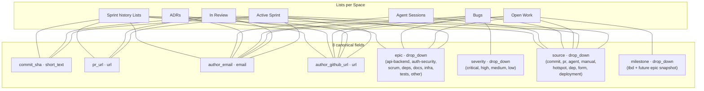
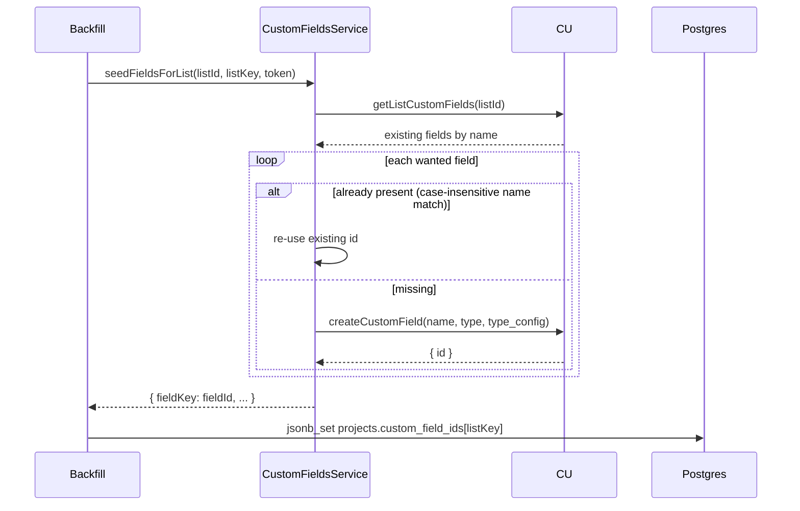
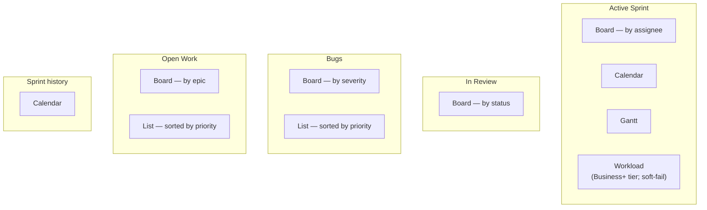
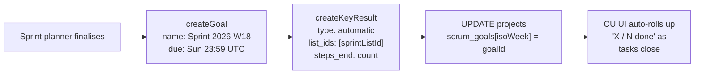
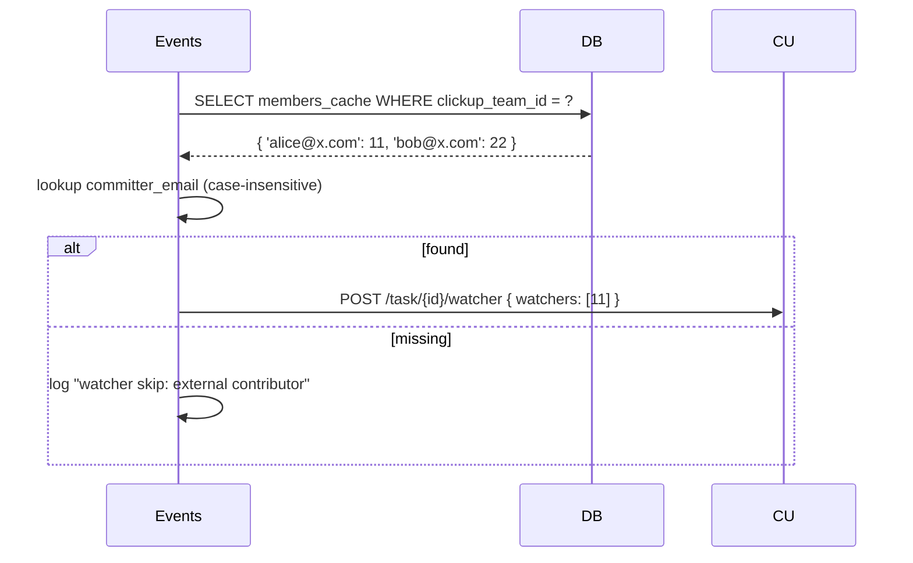
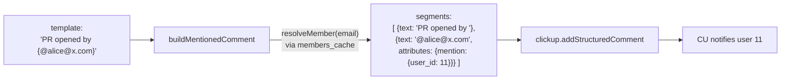

# Custom Fields & Views (Phase E reference)

v0.4.0 added 8 canonical custom fields + a multi-view seed per List. The schema is hard-coded in `service/src/clickup/custom-fields.ts` and `service/src/clickup/views.ts`. This doc enumerates what gets created where, and how to extend.

---

## Field schema (E.1)

8 canonical fields. The set per List comes from `FIELDS_PER_LIST`:



Source: `FIELDS_PER_LIST` in `service/src/clickup/custom-fields.ts`. Sprint history Lists hydrate from the `active_sprint` schema.

---

## How seeding works (idempotent)



Failures per field are logged at debug — never fatal. The next backfill attempt re-tries the missing fields.

---

## Writing values to a task

After creating a commit task, `events.service` writes the structured fields:

```ts
await this.customFields.setFieldsOnTask(
  taskId,
  project.custom_field_ids[listKey],
  {
    commit_sha: dto.commit_sha,
    author_email: dto.committer_email,
    author_github_url: identity?.github_url,   // from F.1
    source: "commit",
  },
  token,
);
```

`setFieldsOnTask` skips entries whose key has no field id (project pre-dates v0.4.0 seeding) and skips empty/null/undefined values. Per-value failures are debug-logged and continue.

---

## View schema (E.3)



Idempotent via `listListViews(listId)` + case-insensitive name match. Tier-gated views (Workload) demote 4xx to debug log so non-Business+ workspaces stay quiet.

Source: `VIEWS_PER_LIST` + `SPRINT_LIST_VIEWS` in `service/src/clickup/views.ts`.

---

## Sprint Goals (E.4)

When the sprint planner finalises a plan (non-dryRun), it creates:

1. One **Goal** named `Sprint <isoWeek>` with the chosen goal text + velocity stats in description, due Sunday 23:59:59Z of that week
2. One **Key Result** of `type: automatic`, linked to the sprint List, with `steps_end = selected.length`. CU rolls up "Tasks Done" automatically.



Persisted to `projects.scrum_goals` keyed by ISO week so re-running the planner doesn't duplicate goals.

---

## Watchers (E.5)

After commit task creation, the daemon resolves the author email against `workspace_settings.members_cache` (case-insensitive) and adds the user as a watcher on the new task — so they get CU notifications for status changes / comments without needing to be the assignee.



---

## Structured @-mentions (E.6)

Lifecycle comments use the v2 `comment` array form so mentions fire real notifications (vs plain `@email` text which CU does NOT auto-mention):



Source: `service/src/clickup/mentions.ts` + `addStructuredComment` in `clickup-direct.service.ts`.

---

## Adding a new field

1. Add the key to `FieldKey` union in `custom-fields.ts`
2. Add a `FieldSpec` entry to `FIELD_SPECS`
3. Add the key to whichever Lists need it in `FIELDS_PER_LIST`
4. Either rebuild the Space (full v0.4.0 seed) or trigger a partial re-seed via `POST /projects/:id/repair-routing` (which re-runs the relevant scaffold steps idempotently)

Existing tasks won't get the new field's value — only future writes via `setFieldsOnTask` will populate. To backfill existing tasks, write a one-shot migration that walks `task_index` and calls `setCustomFieldValue` per task.

---

## Adding a new view

1. Add the entry to `VIEWS_PER_LIST` in `views.ts` (or `SPRINT_LIST_VIEWS` for sprint Lists)
2. Mark `tierGated: true` if it requires Business+ (Workload, etc.)
3. Re-run backfill — `seedViewsForList` is idempotent

The grouping/sorting/filters object schema is whatever CU's API accepts at the time. CU silently ignores unknown sub-fields, so your view will at least render even if the grouping doesn't take effect — useful when a feature you depend on rolls out.
