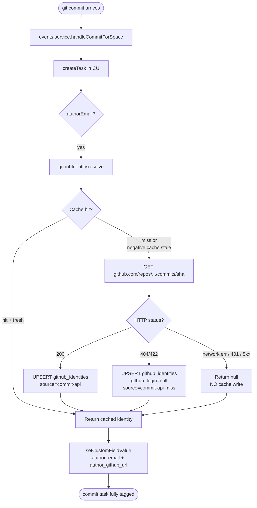
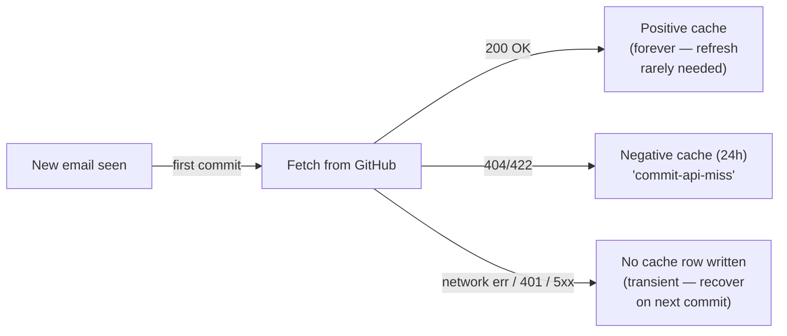

# GitHub Identity Bridge (Phase F)

v0.4.0 added a translation layer from raw commit-author email → cached GitHub identity (login + avatar + profile URL). Without this, every CU surface that mentions an author shows `## achrafalaoui14@gmail.com` — fine for grep, awful for human readers.

This doc covers `service/src/projects/github-identity.service.ts` (F.1), how it integrates with the commit lifecycle (F.3), and where the identity surfaces (F.2 standup, F.4 contributors).

---

## High-level flow



---

## Caching policy (the why)



**Why differentiate transient vs miss?**

- A 404 means *the commit author is not a GitHub user* (e.g. `noreply@example.com`, anonymous bot). Re-fetching every commit would burn rate limit. → 24h cache.
- A network error or 401 means the daemon's connectivity / token has a problem the operator can fix. Caching it would mean the email stays unresolved for 24h *after* the fix. → no cache; retry on next commit.

Source: `fetchFromGithub` returns a discriminated union `{ kind: "ok" | "miss" | "network-error" }`.

---

## Rate-limit handling

GitHub's anonymous limit is 60 req/h per IP; the authenticated limit (via `GITHUB_TOKEN`) is 5000/h.

```mermaid
sequenceDiagram
  participant Daemon
  participant GH as GitHub API

  Daemon->>GH: GET /repos/X/commits/Y
  GH-->>Daemon: 200 + X-RateLimit-Remaining: 4
  Note right of Daemon: remaining < 5 →<br/>arm halt window 60s
  Daemon->>Daemon: rateLimitHaltUntil = now+60s

  Daemon->>Daemon: next resolve(other_email)
  Daemon->>Daemon: now < rateLimitHaltUntil?
  Daemon->>Daemon: yes → skip fetch, serve cache or null
  Note right of Daemon: After 60s, halt expires;<br/>fetches resume.
```

The halt is process-local (not persisted). On daemon restart it clears — fine because by then GitHub has likely refilled the bucket.

---

## Setting GITHUB_TOKEN

The daemon picks up `GITHUB_TOKEN` from its env at fetch time. Two ways:

```bash
# Option A — via .env (loaded by docker compose)
echo "GITHUB_TOKEN=ghp_yourtoken" >> .env
docker compose up -d clickup-tracker

# Option B — via shell env, only persists for this docker run
GITHUB_TOKEN=ghp_yourtoken docker compose up -d clickup-tracker
```

**Token scopes needed:** `public_repo` (or `repo` for private repos). Fine-grained PATs work too — grant **Read access to commits** on the relevant repos.

If the token is omitted, the daemon falls back to anonymous (60/h). At typical commit cadence this is plenty for one developer; multi-developer workspaces should set the token.

**Never paste the token into a chat session.** If you accidentally do, revoke at <https://github.com/settings/tokens> immediately.

---

## Where identities surface

```mermaid
graph TD
  cache[(github_identities)]
  cache -->|F.3| commit_task["Commit task<br/>custom fields:<br/>author_email, author_github_url"]
  cache -->|F.2| standup["Standup Doc page<br/>## ![avatar] [login](url)<br/>*email*"]
  cache -->|F.4| endpoint["GET /projects/:id/contributors<br/>{ stats, githubLogin, avatarUrl }"]
  cache -.->|G.3 (PR-4)| handbook["Contributors Handbook page<br/>(auto-updated weekly)"]
```

---

## Schema

```sql
CREATE TABLE clickup_tracker.github_identities (
  email          TEXT PRIMARY KEY,        -- lowercase
  github_login   TEXT,
  github_url     TEXT,
  avatar_url     TEXT,
  resolved_at    TIMESTAMPTZ NOT NULL DEFAULT NOW(),
  source         TEXT NOT NULL DEFAULT 'commit-api',
  raw            JSONB                    -- full API response, for debugging
);
CREATE INDEX github_identities_login
  ON clickup_tracker.github_identities (github_login)
  WHERE github_login IS NOT NULL;
```

The `email` PK is **case-folded** at insert time so `Alice@X.com` and `alice@x.com` collapse.

---

## Verifying after deploy

```bash
BASE=$(jq -r .base_url ~/.config/clickup-tracker/config.json)
ORG=$(jq -r .default_org_id ~/.config/clickup-tracker/config.json)
AUTH=$(jq -r .auth_token ~/.config/clickup-tracker/config.json)
PID=<your project id>

# Check the cache size
docker compose exec postgres psql -U cup -d clickup_tracker -c \
  "SELECT COUNT(*) FILTER (WHERE github_login IS NOT NULL) AS resolved,
          COUNT(*) FILTER (WHERE github_login IS NULL) AS misses
   FROM clickup_tracker.github_identities;"

# Get all contributors for a project
curl -fsS -H "Authorization: Bearer $AUTH" -H "X-Organisation-Id: $ORG" \
  "$BASE/projects/$PID/contributors" | jq '.[] | {email, githubLogin, commits30d: .stats.commits30d}'
```

---

## Limitations / non-goals

- **Only github.com**. `git_remote_host` must be `github.com` for resolve to fetch — gitlab/bitbucket/gitea fall through to cache-only behaviour. (Phase Q candidate.)
- **No avatar caching to local CDN**. Doc pages embed the GitHub-hosted avatar URL directly. If GitHub changes the URL or the user deletes their avatar, the Doc page breaks. Acceptable trade-off vs. a CDN.
- **No reverse lookup** (login → email). Useful for PR-comment ingestion (Phase M) — added there.
- **No webhook-driven updates**. If a user changes their avatar on GitHub, the cached row stays stale until the *next* lookup that would have written that row anyway.
