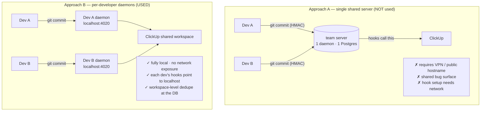
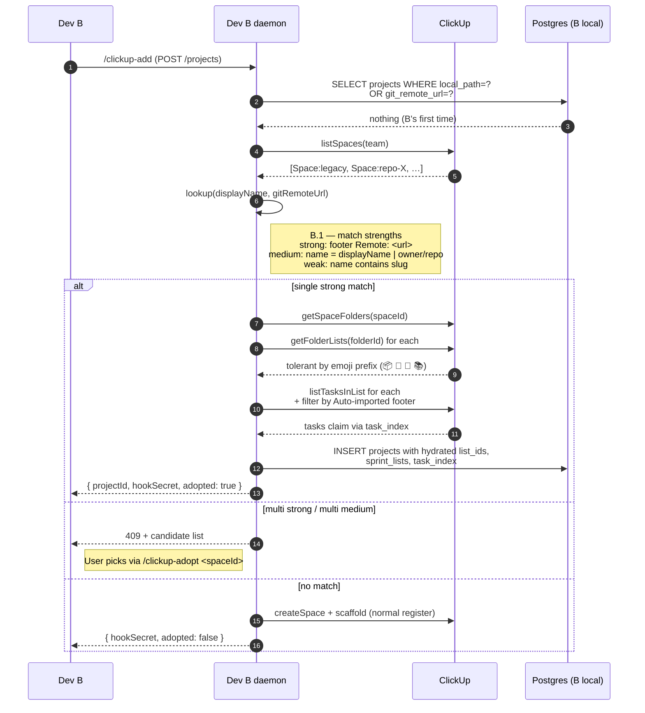
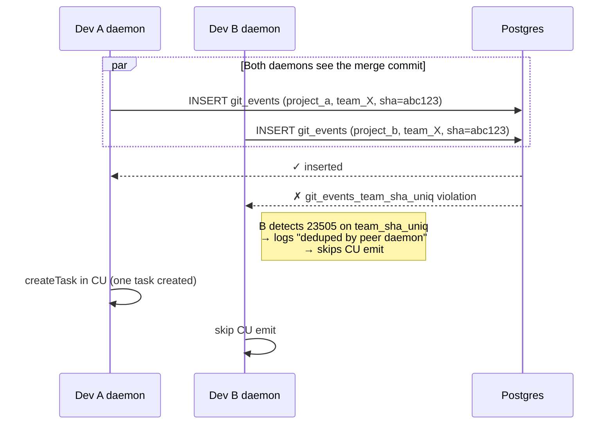
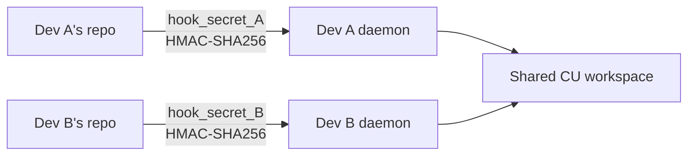
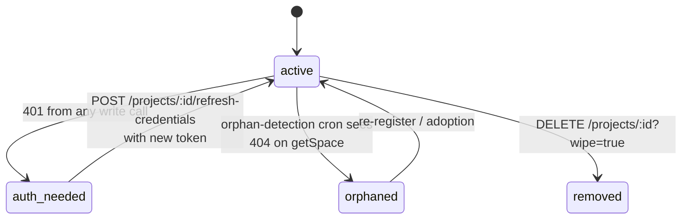
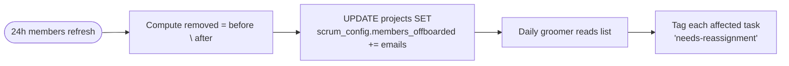

# Multi-Developer Adoption

clickup-tracker runs **per-developer** by default — each developer's machine has its own daemon with its own Postgres + Redis. But several developers can share **one ClickUp workspace** without their daemons stepping on each other.

This doc covers the v0.2.x + v0.3.0 adoption flow. It assumes you've read [`architecture.md`](./architecture.md).

---

## Why per-developer (and not per-team server)?



The trade-off: **two daemons must agree on the same Space without re-creating it**. That's what *adoption* solves.

---

## Adoption flow (Plan §B.1 + §B.2)

When developer B runs `/clickup-add` against a repo developer A already registered, the daemon:

1. Looks up existing Spaces in the workspace
2. Ranks candidates by **match strength** (strong → medium → weak)
3. **Adopts** an existing match; never auto-creates a duplicate



Source: `service/src/projects/lookup.service.ts` + `service/src/projects/adopt.service.ts`.

---

## What gets claimed during adoption

Adoption only claims **auto-imported tasks** (those with `_Auto-imported by clickup-tracker._` footer in their description). Manual tasks created by humans in the CU UI are left untouched — the daemon never re-claims them.

```mermaid
graph TD
  subgraph cu["Existing CU Space"]
    A[task: feat(api): X<br/>footer: Auto-imported]
    B[task: bug from QA<br/>NO footer]
    C[task: BUG-7 follow up<br/>footer: Auto-imported]
    D[task: ad-hoc TODO<br/>NO footer]
  end
  A & C -->|claim| index[B's task_index]
  B & D -.->|leave alone| extra[B's extra_lists.untouched]
```

Source: `service/src/projects/adopt.service.ts:matchListKey` + footer regex.

---

## Workspace-level dedupe (B.4)

The same SHA committed by Dev A and Dev B (e.g. after a merge) used to result in **two CU tasks** — one per daemon. Schema 03 fixes this with a partial UNIQUE on `(clickup_team_id, commit_sha)`:



Source: `service/src/events/events.service.ts:182-215` (the team-sha conflict detection block) and `schema/03_collab_and_scrum.sql:14-30`.

---

## Per-developer secret model (B.6)

Each developer's daemon has its own `hook_secret`. The post-commit hook embeds this secret in the HMAC, so even if a dev clones the repo, they can't write events for another dev's project without re-installing the hook with their own secret:



Each task's CU description footer also includes a daemon attribution stamp (Plan §B.6):

```
_Daemon: dev-laptop-1:8a3f9c7d_
```

The 8-char suffix is `sha256(hook_secret).slice(0,8)` — never the secret itself. Allows post-hoc audit of "which daemon created this task" without leaking credentials.

---

## Coordinated webhook ownership (B.5)

Only **one** daemon creates the CU outbound webhook per workspace (subsequent daemons reuse it):

```mermaid
sequenceDiagram
  participant A as Daemon A (first registration)
  participant B as Daemon B (later registration)
  participant PG as Postgres
  participant CU as ClickUp

  A->>PG: workspace_settings.webhook_id NULL?
  PG-->>A: yes
  A->>CU: createWebhook
  CU-->>A: { id, secret }
  A->>PG: UPSERT workspace_settings { webhook_id, webhook_secret }

  B->>PG: workspace_settings.webhook_id NULL?
  PG-->>B: NO (already set by A)
  B->>B: log "webhook already registered; skipping"
  B->>PG: read webhook_secret for inbound HMAC verification
```

Source: `service/src/backfill/backfill.service.ts` step 14.

---

## Auth-needed state machine (B.6)

When a daemon's CU token expires (rotated, revoked), it doesn't crash — it parks the project in `auth-needed` state:



Source: `service/src/projects/projects.service.ts:flipToAuthNeeded` + `service/src/events/events.service.ts:isAuth401`.

When transitioning to `auth-needed`, the daemon posts a single warning task to Open Work: `[Auth] Token expired — run /clickup-refresh`. No further CU writes happen for that project until the operator runs `POST /projects/:id/refresh-credentials`.

---

## Worktree dedupe (B.7)

A repo cloned twice (e.g. via `git worktree add`) is the *same* logical project — same git remote URL. Adoption logic:

```sql
SELECT * FROM clickup_tracker.projects
WHERE organisation_id = $1::uuid
  AND status <> 'removed'
  AND (local_path = $2::text OR ($3::text IS NOT NULL AND git_remote_url = $3::text))
ORDER BY (local_path = $2) DESC NULLS LAST  -- prefer exact path match
LIMIT 1
```

Source: `service/src/projects/projects.service.ts:findByLocalPathOrRemote`.

---

## Member offboarding (B.9)

When a member leaves the workspace, their assignments orphan. The members-cache refresh diff records this:



Source: `service/src/backfill/backfill.service.ts:diffOffboardedEmails` + `recordOffboardedMembers`.

---

## Operator runbook for multi-dev

```bash
# Dev B joining a workspace where Dev A already registered repo X
cd /home/devB/code/x
/clickup-lookup x        # see candidate Spaces
/clickup-adopt 90127344517   # explicit adoption

# Or just /clickup-add — adoption is automatic when a strong/single-medium match exists.

# If you see 409 with multiple candidates:
/clickup-adopt <chosen-space-id>

# If your token expires:
/clickup-refresh         # re-runs OAuth bootstrap; flips status back to active
```
