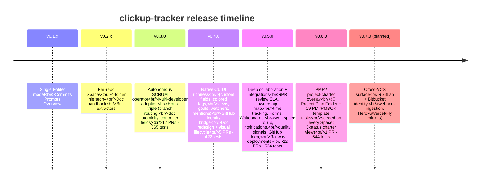
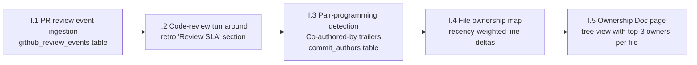
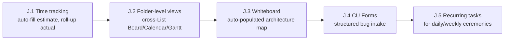
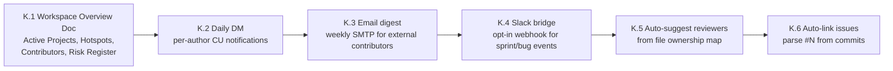
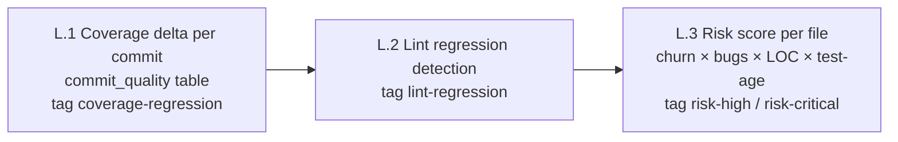
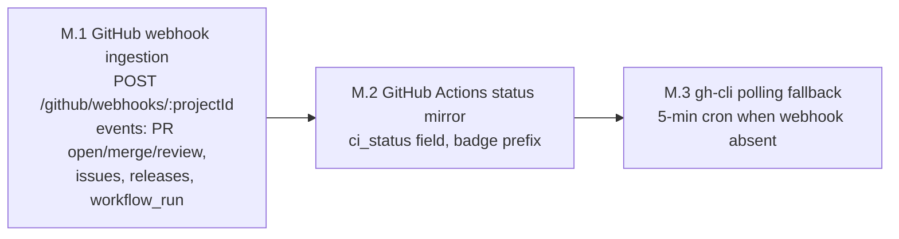

# Roadmap

Tracks released and planned milestones. Maintained alongside the deep plan at `~/.claude/plans/sleepy-crunching-ember.md` (architect-facing) and CHANGELOG.md (release-facing).

---

## Released

### v0.4.0 ship list (released)

| PR | Phase | Status |
|---|---|---|
| #51 | E.1 + E.2 — Custom fields + colored space tags | merged |
| #52 | E.3-E.6 — Views + Goals + Watchers + structured mentions | merged |
| #53 | F.1-F.4 — GitHub identity + Contributors endpoint | merged |
| #55 | G.1-G.3 — Doc page redesign (standup with progress bars + per-author tables, retro with sparkline, new Handbook pages) | merged |
| #56 | H.1-H.4 — Visual lifecycle (emoji prefixes, collapsibles, table comments, attribution-aware Changelog) | merged |

---

## v0.5.0 — Deep collaboration + integrations (~12 PRs)

### Phase I — Deeper collaborator tracking

### Phase J — Richer CU surfaces

### Phase K — Cross-project rollup + notifications + automation

### Phase L — Quality signals

### Phase M — Deeper GitHub integration

### Phase N — Railway deployment tracking

```mermaid
graph LR
  N1[N.1 Railway GraphQL client] --> N2[N.2 Project ↔ Railway service binding]
  N2 --> N3["N.3 Deployment polling cron<br/>2-min · creates 🚀 Deployments List"]
  N3 --> N4[N.4 Per-deployment task lifecycle<br/>status emoji, logs, mentions]
  N4 --> N5[N.5 Cross-link to commits<br/>tag deployed_to_<env>]
  N5 --> N6[N.6 Custom fields<br/>environment, deployment_status,<br/>commit_sha, build_duration, deploy_url]
  N6 --> N7[N.7 Standup + retro<br/>deployment frequency, MTTR]
  N7 --> N8[N.8 Optional Railway webhook]
  N8 --> N9[N.9 Deployments Doc page]
  N9 --> N10[N.10 /clickup-deploy-status slash command]
```

---

## v0.5.0 PR breakdown (released 2026-05-03)

| PR | Phase(s) | Status |
|---|---|---|
| PR-6 | I.1 + I.2 + I.3 | merged |
| PR-7 | I.4 + I.5 | merged |
| PR-8 | J.1 + J.2 + J.3 | merged |
| PR-9 | J.4 + J.5 | merged |
| PR-10 | K.1 + K.2 + K.3 | merged |
| PR-11 | K.4 + K.5 + K.6 | merged |
| PR-12 | L.1 + L.2 | merged |
| PR-13 | L.3 | merged |
| PR-14 | M.1 | merged |
| PR-15 | M.2 + M.3 | merged |
| PR-16 | N.1 + N.2 + N.3 + N.6 | merged |
| PR-17 | N.4 + N.5 + N.7 + N.8 + N.9 + N.10 | merged |

**Total:** 12 PRs · 534 tests passing.

---

## v0.6.0 — PMP / project-charter overlay (released 2026-05-05)

| PR | Phase(s) | Status |
|---|---|---|
| PR-18 | O — `📘 Project Plan` Folder + 19 PMI template tasks | merged |

**Total:** 1 PR · 544 tests passing.

Every per-repo Space now ships with a 5th `📘 Project Plan` Folder seeded with 19 charter sections (Scope Management, Risk Log, RACI Matrix, Communication Plan, …) on a dedicated 3-status List. Idempotent via `task_index["pmp:*"]`; existing Spaces upgrade lazily on the next backfill tick. No schema apply, no Space wipe.

---

## Out of scope (deferred)

- LLM-driven sprint planning / NLP standup commentary
- Cross-workspace federation
- GitLab / Bitbucket / Gitea identity bridges (Phase Q candidate)
- Heroku / Vercel / Fly deployment tracking (mirror Railway pattern when needed)
- Bundled holiday calendar (operator-curated `scrum_config.holidays[]`)
- PTO/vacation awareness
- Per-task SLA tracking with alerts
- Real-time co-presence
- PagerDuty / Opsgenie incident bridge
- Auto-rollback on deploy failure
- Cost telemetry per Railway service
- LLM standup generation
- Avatar caching to local CDN

---

## Versioning

- **Major bumps (v1.0.0+)** — breaking schema changes that require manual migration
- **Minor bumps (v0.4.0 → v0.5.0)** — new phase milestones; additive schema changes (auto-applied via `schema/0X_*.sql`)
- **Patch bumps (v0.4.1)** — bug fixes, no schema changes

Schema migrations are append-only. To go from v0.X to v0.Y, apply every `schema/0X_*.sql` ≤ Y in order. They're idempotent — safe to re-apply on existing volumes.
