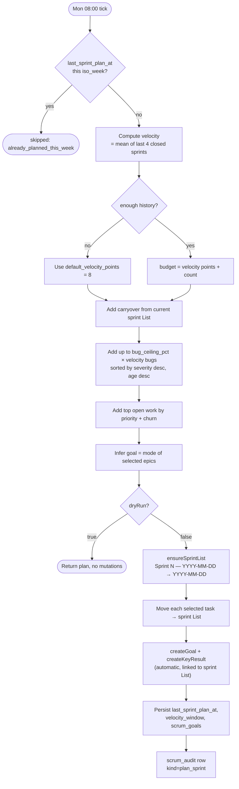
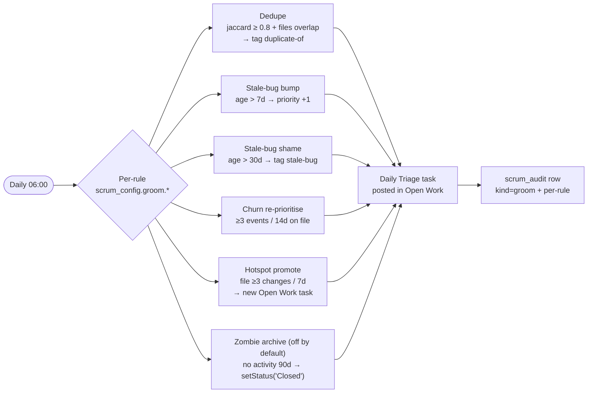
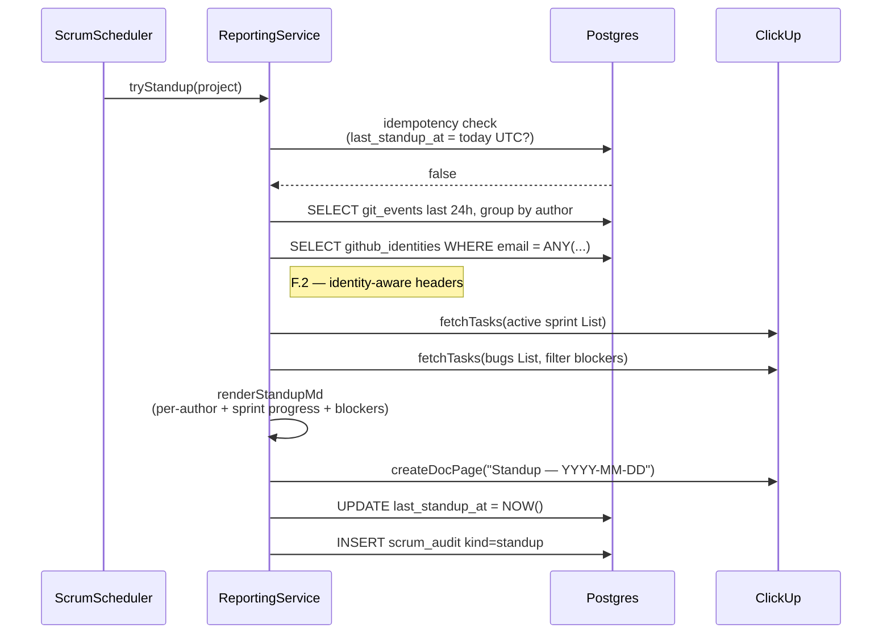
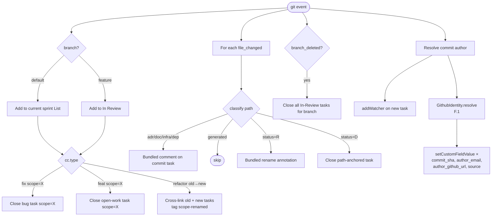
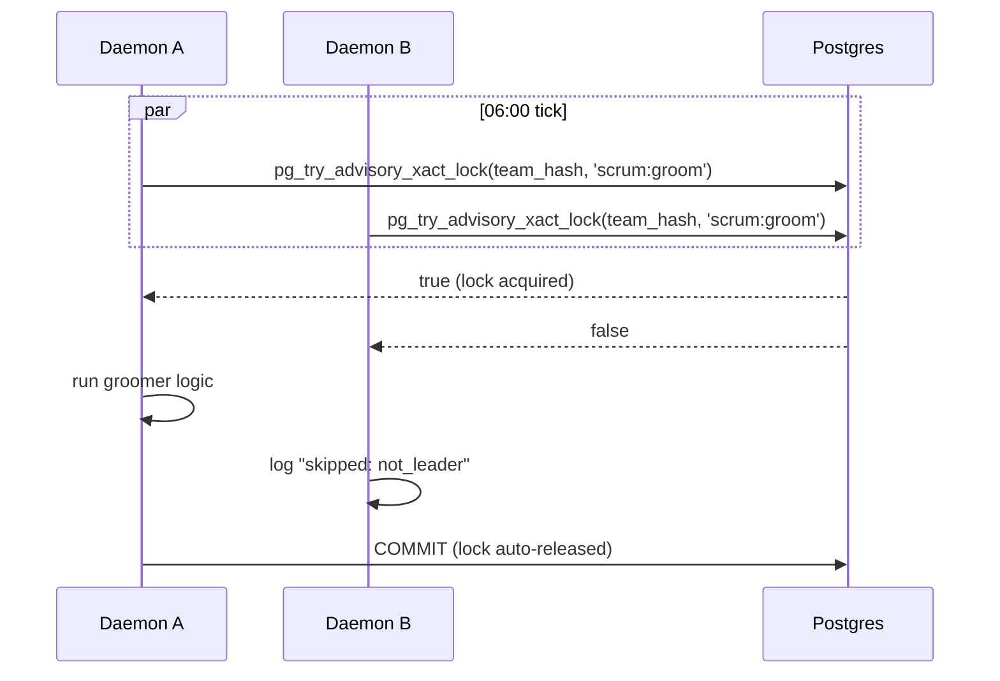

# Autonomous SCRUM Operator

The daemon runs four autonomous scrum ceremonies on a schedule, plus a continuous lifecycle layer that reacts to every commit and webhook. All actions are **reversible**, **audited**, **dry-runnable**, and **killable**.

This doc covers the v0.3.0+ SCRUM operator. For what makes it into CU as a result, see [`scrum-tracked-artifacts.md`](./scrum-tracked-artifacts.md).

---

## Ceremony schedule (default)

```mermaid
gantt
  title Scrum operator weekly cadence (UTC)
  dateFormat HH:mm
  axisFormat %H:%M
  section Daily
  Groomer (06:00)            :done, g1, 06:00, 5m
  Standup (08:30 Tue–Fri / 09:00 Mon) :done, s1, 08:30, 10m
  section Sprint cycle
  Sprint plan (Mon 08:00)    :done, p1, 08:00, 15m
  Retro (Sun 18:00)          :done, r1, 18:00, 15m
```

Override via `scrum_config` per project (POST `/projects/:id/scrum/config`):

```json
{
  "tz": "Europe/London",
  "plan_cron": "0 8 * * 1",
  "groom_cron": "0 6 * * *",
  "standup_cron_weekdays": "30 8 * * 2-5",
  "standup_cron_monday": "0 9 * * 1",
  "retro_cron": "0 18 * * 0",
  "skip_weekends": true,
  "holidays": ["2026-12-25"]
}
```

Master poll runs every 5 min via `ScrumScheduler` (`service/src/scrum/scrum.scheduler.ts`); per-project crons fire when their UTC-aware "next time" has passed and idempotency check confirms not-yet-run.

---

## The 7 autonomy invariants


- **Reversible** — no `delete` / hard archive. Status='Closed' + tag instead.
- **Audited** — every action emits a `scrum_audit` row.
- **Dry-runnable** — every endpoint accepts `?dryRun=true`.
- **Killable** — `CUP_AUTOSCRUM=off` env disables ALL crons.
- **Idempotent within window** — `last_*_at` + idempotency key (sprint=isoWeek, standup=date).
- **Rate-limit-aware** — every cron call uses `'scrum'` priority on the limiter, so lifecycle traffic preempts under contention.
- **Single-leader per workspace** — `pg_try_advisory_xact_lock(team_id_hash, ceremony_hash)`; followers skip silently.

---

## C.1 — Sprint planner



Source: `service/src/scrum/sprint-planner.service.ts`. Goal creation (E.4) is best-effort — failures don't block planning.

---

## C.2 — Daily groomer



Source: `service/src/scrum/groomer.service.ts`. Each rule is independently togglable in `scrum_config.groom.{dedupe,stale_bug_bump,…}`.

---

## C.4 — Standup + Retro reporter



Source: `service/src/scrum/reporting.service.ts`. Retro mirrors this on Sunday 18:00 — pulls velocity_window for sparkline (Phase G.2), bug throughput, carryover analysis.

---

## C.3 — Continuous lifecycle layer (real-time, not cron)

Triggered by `POST /public/git-events` (post-commit hook) and `POST /public/clickup-webhook` (CU outbound). Runs *inline* per event.



Source: `service/src/events/events.service.ts`.

---

## Audit trail

Every autonomous action writes a row to `clickup_tracker.scrum_audit`. Operator-readable via:

```bash
curl -fsS -H "Authorization: Bearer $AUTH" -H "X-Organisation-Id: $ORG" \
  "$BASE/projects/$PID/scrum/audit?since=$(date -d '7 days ago' -Iseconds)&limit=100"
```

Schema:

| Column | Purpose |
|---|---|
| `kind` | `plan_sprint`, `plan_sprint:move`, `groom`, `groom:dedupe`, `standup`, `retro`, … |
| `target` | task_id, list_id, or null for cross-cutting |
| `before` / `after` | JSONB diffs |
| `reason` | Human-readable (e.g. `"carryover"`, `"warming up — no history"`) |
| `dry_run` | True for `?dryRun=true` invocations |

---

## Single-leader concurrency

When two daemons run against the same workspace (multi-developer mode — see [`multi-developer.md`](./multi-developer.md)), only one runs each scrum tick:



Lock is **transaction-scoped** for short ceremonies (groom, standup, retro) so a crashed leader's lock auto-releases. Sprint planner uses session-scoped lock with explicit unlock on completion (its long ClickUp API window would hold the txn open too long otherwise).

Source: `service/src/scrum/leadership.service.ts`.

---

## Tunables (full `scrum_config` shape)

```json
{
  "enabled": true,
  "tz": "Europe/London",
  "plan_cron": "0 8 * * 1",
  "groom_cron": "0 6 * * *",
  "standup_cron_weekdays": "30 8 * * 2-5",
  "standup_cron_monday": "0 9 * * 1",
  "retro_cron": "0 18 * * 0",
  "skip_weekends": true,
  "holidays": [],
  "bug_ceiling_pct": 0.30,
  "velocity_window_size": 8,
  "velocity_window_recent": 4,
  "default_velocity_points": 8,
  "groom": {
    "dedupe": true,
    "stale_bug_bump": true,
    "stale_bug_shame": true,
    "churn_reprioritise": true,
    "hotspot_promote": true,
    "zombie_archive": false
  },
  "members_offboarded": []
}
```

PATCH any subset via `PATCH /projects/:id/scrum/config` — deep-merged.

---

## Killing the operator

| Scope | How |
|---|---|
| All projects, all daemons | `export CUP_AUTOSCRUM=off` then `docker compose restart clickup-tracker` |
| One project | `PATCH /projects/:id/scrum/config` with `{ "enabled": false }` |
| One ceremony, one project | `PATCH /projects/:id/scrum/config` with e.g. `{ "groom": { "hotspot_promote": false } }` |
| Manual override (dry-run) | `POST /projects/:id/scrum/{plan-sprint,groom,standup,retro}?dryRun=true` |
