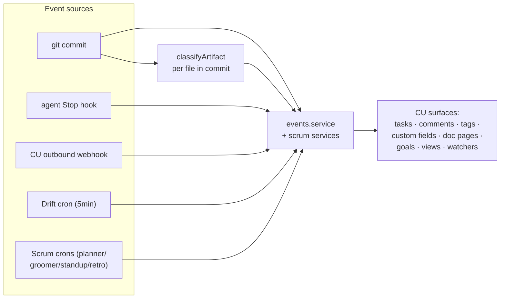
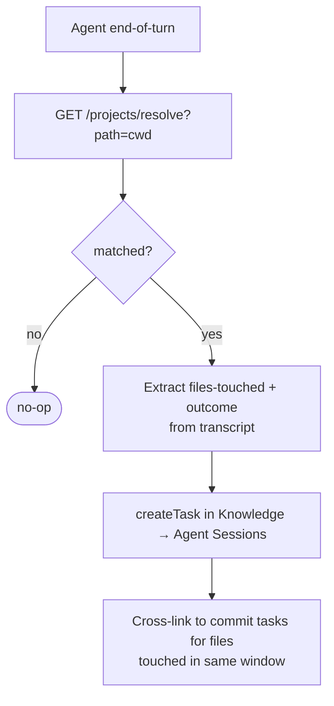
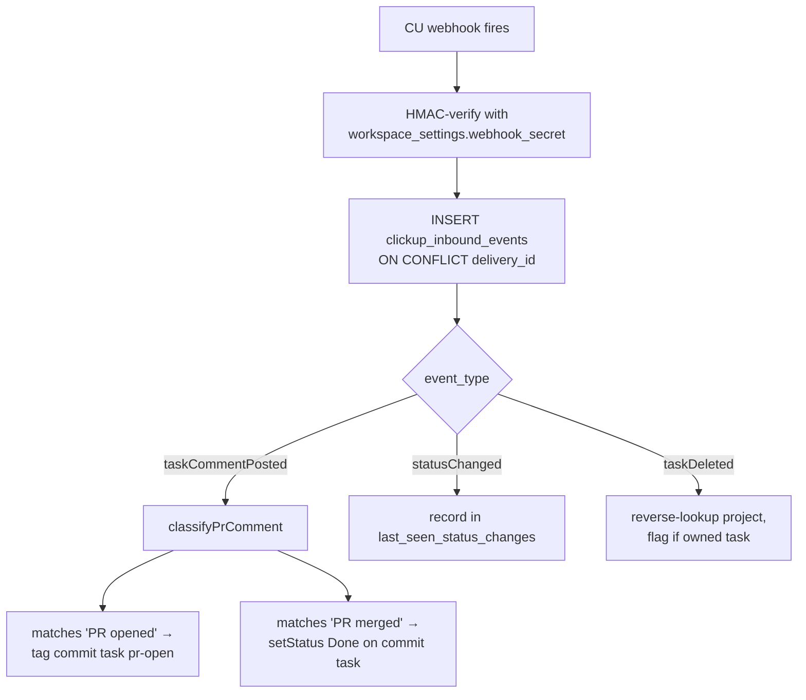
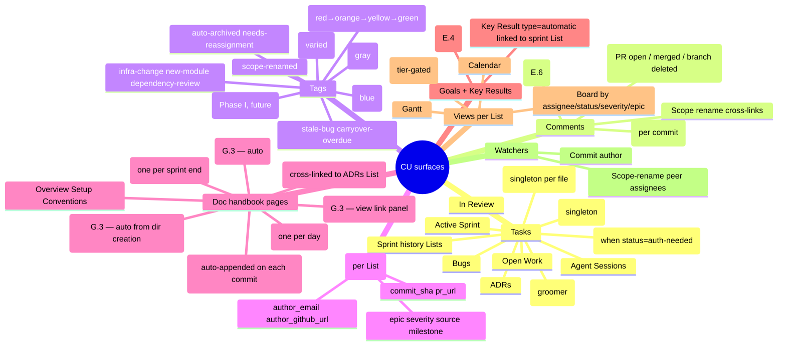
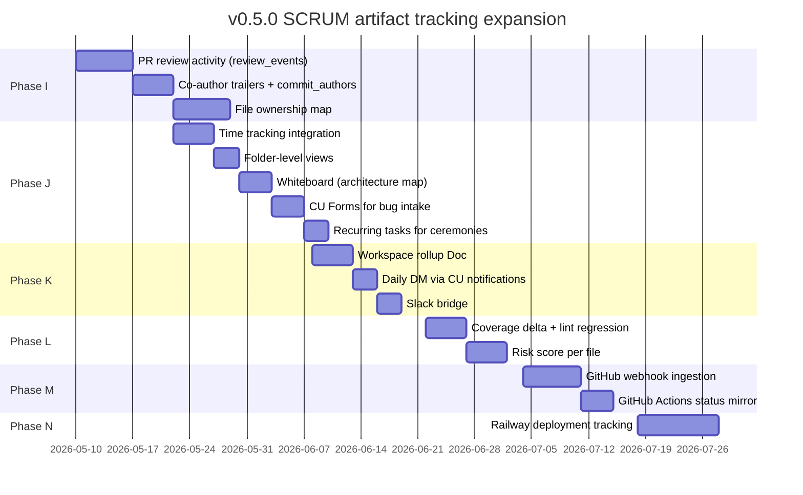

# What the SCRUM operator surfaces in CU

The "everything that should be tracked" catalog. This doc is a reference for what kinds of artifacts the daemon surfaces in ClickUp, where they appear, and how they're classified.

If you're trying to understand *why* a particular file/event/change shows up (or doesn't), you're in the right place.

---

## Pipeline at a glance



---

## Per-event-source artifact catalog

### git commit (post-commit hook)

```mermaid
graph TD
  c[git commit arrives] --> sprint[Sprint List task<br/>or In Review task]
  c --> changelog[Append to Doc 'Changelog' page<br/>if default branch]
  c --> watcher[addWatcher: commit author]
  c --> fields["Custom fields:<br/>commit_sha, author_email,<br/>author_github_url, source"]
  c --> identity[github_identities cache hydrate]
  c --> per_file[For each file_changed]

  per_file --> kind{classify}
  kind --> generated[(generated)<br/>suppress]
  kind --> code[(code)<br/>no extra action]
  kind --> adr[(ADR)<br/>bundled comment + future ADR task]
  kind --> doc["(doc · README/CHANGELOG/<br/>docs/*.md)<br/>bundled comment in commit task"]
  kind --> infra["(infra · Dockerfile, k8s,<br/>workflows, terraform)<br/>bundled comment + tag infra-change"]
  kind --> dep["(dependency · package.json,<br/>pyproject, Cargo, …)<br/>bundled comment"]
  kind --> cfg["(config-schema · .env.example,<br/>*.schema.json)<br/>bundled comment"]
  kind --> sub[(submodule)<br/>bundled comment]
  kind --> bin["(binary-resource ·<br/>>100KB or img/font/zip)<br/>size-only comment"]
  kind --> rename[("status=R (rename)")<br/>bundled rename annotation]
  kind --> delete[("status=D (delete)")<br/>close path-anchored task]

  c --> conv{conventional<br/>commit type}
  conv --> fix[fix scope=X →<br/>close bug task scope=X]
  conv --> feat[feat scope=X →<br/>close open-work task scope=X]
  conv --> ref[refactor old→new →<br/>cross-link old + new tasks]
  conv --> bug_word[message contains 'BUG-N' →<br/>cross-link to BUG-N task]
```

Source: `service/src/events/events.service.ts` + `service/src/util/classify.ts`.

### agent Stop hook (Claude Code, Goose, OpenCode, …)



Source: `service/src/events/events.service.ts:ingestPrompt` + agent-side hook scripts in `scripts/install-claude-code.sh`.

### CU outbound webhook (taskCommentPosted, statusChanged, etc.)



Source: `service/src/sync/sync.service.ts:processInboundRow`.

### Drift cron (every 5 min)

For each active project:

1. `git -C <localPath> rev-parse HEAD`
2. Compare to `last_synced_commit` in DB
3. For each missed commit, enqueue `process_commit` (deduped by `commit_sha`)
4. Refresh Doc Overview if README/CHANGELOG changed since last sync

Source: `service/src/sync/drift.cron.ts`.

### Orphan detection cron (every 30 min)

For each active project, ping `getSpace(clickup_space_id)`. On 404 → flip `status = 'orphaned'` (one-way; manual re-register clears it).

Source: `service/src/projects/orphan-detection.cron.ts`.

### Scrum crons (planner / groomer / standup / retro)

See [`scrum-operator.md`](./scrum-operator.md). Each emits its own constellation of CU surfaces — tasks moved into sprint Lists, Daily Triage tasks, Doc pages for standup/retro, CU Goals + Key Results, audit rows.

---

## Surface taxonomy

What CU primitives the daemon writes to:



---

## Classifier reference (`classifyArtifact`)

The single source of truth for "what kind of file is this" is `service/src/util/classify.ts`:

| Kind | Trigger pattern | Action in CU |
|---|---|---|
| `generated` | `^(dist\|build\|node_modules\|\.next\|coverage\|target\|__pycache__)/` or lockfiles | Suppressed entirely |
| `code` | Default | No special action |
| `adr` | `^(docs/(adr\|decisions)/.*\.md\|.*/adr/.*\.md\|ARCHITECTURE\.md)$` | Bundled comment + (future) ADR task |
| `doc` | `README\|CHANGELOG\|CONTRIBUTING\|CODE_OF_CONDUCT\|SECURITY` or `^docs/.*\.md$` | Bundled comment |
| `infra` | `Dockerfile`, `docker-compose*.yml`, `.github/workflows/*.yml`, `*.tf`, `kubernetes/` | Bundled comment + tag `infra-change` |
| `dependency` | `package.json`, `pyproject.toml`, `Cargo.toml`, `go.mod`, `requirements*.txt`, `Gemfile`, `composer.json` | Bundled comment + (Phase L) `[Deps] Review` task |
| `config-schema` | `.env.example`, `*.example`, `*.schema.json` | Bundled comment |
| `submodule` | `.gitmodules` | Bundled comment |
| `binary-resource` | size > 100KB, or `*.png/jpg/gif/webp/svg/pdf/zip/tar/gz/woff2?/ttf/eot/ico/mp[34]` | Bundled comment with size |
| `directory-creation` | (computed via `wasDirNewBeforeCommit`) | (Phase C.5/H.1) `[Module] New: <path>` task |

To add a new kind:
1. Add a regex branch to `classifyArtifact`
2. Add a handler `handleXChange` in `events.service`
3. Wire dispatch in `tryAppendArtifactWatch` or the per-handler dispatch

---

## What's NOT tracked (intentionally)

- **Generated files** (lockfiles, dist/, build/, node_modules/) — noise, not signal
- **Branch state changes** that aren't deletions (the daemon doesn't mirror every push)
- **Local-only state** (.vscode/, .idea/, .DS_Store)
- **Files outside the project's `scope_config.paths`** if scope is configured
- **Manually-created CU tasks without the auto-imported footer** — adoption explicitly never claims them

---

## Coming in v0.5.0



See [`roadmap.md`](./roadmap.md) for full Phase I-N details.
